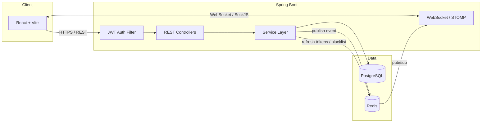

<div align="center">

# TaskFlow

### Real-time collaborative Kanban board built with Spring Boot and React

A full-stack project management tool where teams create boards, organize work into columns, and watch updates sync live across every connected browser — powered by WebSockets and Redis pub/sub.

[](https://openjdk.org/)
[](https://spring.io/projects/spring-boot)
[](https://react.dev/)
[](https://www.postgresql.org/)
[](https://redis.io/)
[](https://www.docker.com/)
[](LICENSE)

[Demo](#demo) · [Features](#features) · [Architecture](#architecture) · [Getting started](#getting-started) · [API reference](#api-reference)

</div>

---

## Overview

TaskFlow is a production-style Trello-inspired Kanban board built to demonstrate real-world backend engineering — not just CRUD. It covers stateless JWT authentication with refresh-token rotation, role-based access control, WebSocket messaging over STOMP, Redis-backed pub/sub for horizontal scalability, and an async audit log, all wired to a drag-and-drop React frontend.

The core engineering problem it solves: **when User A moves a card, every other user looking at that board — across any number of server instances — sees it move instantly, with no polling and no page refresh.**

---

## Demo
https://github.com/user-attachments/assets/2d6e7b5c-97c8-4d01-ab6d-bf1e1d2fbe6f


---

## Features

### Authentication & security
- Stateless JWT authentication with short-lived access tokens (15 min) and rotating refresh tokens (7 days)
- Refresh tokens stored in Redis with TTL; token blacklisting on logout
- Password hashing with BCrypt
- Role-based authorization at both the application level (`USER`/`ADMIN`) and board level (`ADMIN`/`MEMBER`/`VIEWER`)
- CORS and stateless session configuration via Spring Security filter chain

### Boards, columns & cards
- Full CRUD on boards, columns, and cards with cascading deletes
- Drag-and-drop card movement with position-aware reordering (no gaps, no duplicate positions)
- Card metadata: priority levels, assignees, due dates, descriptions
- Board membership management — invite, change roles, remove members
- Per-board settings (rename, delete) restricted to board admins

### Real-time collaboration
- WebSocket connections over STOMP with SockJS fallback for older browsers
- Redis pub/sub fan-out — events broadcast through Redis so the architecture scales horizontally across multiple backend instances without losing real-time sync
- Live presence indicators (typing, joined board)
- Every mutation (card moved, created, updated, deleted; column renamed; member added/removed) propagates to all connected clients within milliseconds

### Activity & audit trail
- Append-only activity log per board, stored as JSONB for flexible payloads
- Asynchronous logging (`@Async`) so audit writes never block the request thread
- Paginated activity feed in the UI that also prepends live WebSocket events

### Frontend experience
- Drag-and-drop Kanban UI built with `dnd-kit`, including optimistic updates with automatic rollback on failure
- Dark-themed, custom-designed UI (no default component library look)
- Zustand for client state, with a dedicated event-reducer that merges WebSocket events into local state
- Automatic access-token refresh via Axios interceptors — users are never logged out mid-session unexpectedly

---

## Architecture




### Request flow: moving a card

1. Client sends `PATCH /api/cards/{id}/move`
2. `JwtAuthFilter` validates the bearer token and populates the security context
3. `CardService` recalculates positions and persists the change to PostgreSQL
4. `WebSocketEventPublisher` serializes a `BoardEvent` and publishes it to a Redis channel (`board:{boardId}`)
5. Every backend instance subscribed to that channel receives the message via `BoardEventSubscriber`
6. Each instance pushes the event to its locally connected clients on `/topic/board/{boardId}` via STOMP
7. The React store merges the event into local state — no refetch required

---

## Tech stack

| Layer | Technology |
|---|---|
| **Backend** | Java 21, Spring Boot 3.2, Spring Security, Spring Data JPA, Spring WebSocket |
| **Database** | PostgreSQL 16, Flyway (versioned migrations) |
| **Caching / messaging** | Redis 7 (refresh tokens, blacklisting, pub/sub fan-out) |
| **Real-time** | STOMP over WebSocket, SockJS fallback |
| **Auth** | JWT (JJWT), BCrypt |
| **Frontend** | React 18, Vite, Tailwind CSS |
| **State management** | Zustand |
| **Drag and drop** | `@dnd-kit/core`, `@dnd-kit/sortable` |
| **HTTP client** | Axios with interceptor-based token refresh |
| **Containerization** | Docker, Docker Compose (multi-stage builds) |
| **CI/CD** | GitHub Actions (build, test, artifact upload for both services) |

---

## Technical highlights

A few design decisions worth calling out for anyone reviewing the code:

- **Position-aware card ordering.** Cards store an integer `position` per column. Moving a card triggers a bulk shift query (`shiftCardsUp` / `shiftCardsDown`) rather than reordering the full list in application code, keeping the operation a single indexed UPDATE.
- **Bag-fetch avoidance.** Hibernate cannot `JOIN FETCH` two `List`-typed collections in one query (`MultipleBagFetchException`). Board detail queries are split into separate fetches per collection to avoid this entirely.
- **Stateless horizontal scalability.** No server-side session state. Auth is JWT-only; WebSocket fan-out goes through Redis rather than in-memory broker state, so any number of backend replicas can run behind a load balancer.
- **Async audit logging.** Activity log writes are decoupled from the request thread via `@Async`, so audit trail persistence never adds latency to user-facing actions.
- **JSONB activity payloads.** Activity log entries store a flexible JSONB payload rather than a rigid schema, so new event types don't require migrations.
- **Token rotation and revocation.** Refresh tokens are rotated on every use and the previous token is blacklisted in Redis with a matching TTL, preventing replay of stale refresh tokens.

---

## Project structure

```
taskflow/
├── taskflow-api/                 # Spring Boot backend
│   ├── src/main/java/com/taskflow/taskflow_api/
│   │   ├── auth/                 # JWT, login/register, security filter
│   │   ├── user/                 # User entity, repository
│   │   ├── board/                 # Board, columns, members, permissions
│   │   ├── card/                  # Card CRUD and move logic
│   │   ├── websocket/              # STOMP config, Redis pub/sub bridge
│   │   ├── activity/                # Async audit logging
│   │   ├── config/                   # Security, WebSocket, Redis config
│   │   └── common/                    # Shared response wrapper, exceptions
│   ├── src/main/resources/db/migration/  # Flyway SQL migrations
│   └── Dockerfile
├── taskflow-ui/                  # React frontend
│   ├── src/
│   │   ├── api/                  # Axios client + endpoint functions
│   │   ├── store/                 # Zustand stores (auth, board)
│   │   ├── hooks/                  # useWebSocket
│   │   ├── components/board/        # Kanban board, cards, modals
│   │   └── pages/                     # Login, Register, Dashboard, Board
│   └── Dockerfile
├── docker-compose.yml
└── .github/workflows/ci.yml
```

---

## Getting started

### Requirements

- Java 21
- Node.js 20+
- Docker and Docker Compose
- Maven 3.9+ (or use the included wrapper)

### Run with Docker (recommended)

```bash
git clone https://github.com/<your-username>/taskflow.git
cd taskflow

# create a .env file with your own secret
echo "JWT_SECRET=$(openssl rand -base64 32)" > .env

docker-compose up --build -d
```

The app will be available at:
- Frontend: `http://localhost:80`
- Backend API: `http://localhost:8080`

### Run locally for development

**1. Start PostgreSQL and Redis only:**

```bash
docker-compose up postgres redis -d
```

**2. Run the backend:**

```bash
cd taskflow-api
mvn spring-boot:run
```

The API starts on `http://localhost:8080`. Flyway runs migrations automatically on startup.

**3. Run the frontend:**

```bash
cd taskflow-ui
npm install
npm run dev
```

The app starts on `http://localhost:5173` with the dev server proxying `/api` and `/ws` to the backend.

### Environment variables

| Variable | Description | Default (dev) |
|---|---|---|
| `JWT_SECRET` | Base64-encoded signing key, 256-bit minimum | — (required) |
| `SPRING_DATASOURCE_URL` | PostgreSQL JDBC URL | `jdbc:postgresql://localhost:5432/taskflow` |
| `SPRING_DATA_REDIS_HOST` | Redis host | `localhost` |
| `JWT_ACCESS_TOKEN_EXPIRY` | Access token TTL (ms) | `900000` (15 min) |
| `JWT_REFRESH_TOKEN_EXPIRY` | Refresh token TTL (ms) | `604800000` (7 days) |

---

## API reference

Base URL: `/api`

| Method | Endpoint | Description | Auth |
|---|---|---|---|
| `POST` | `/auth/register` | Create a new account | Public |
| `POST` | `/auth/login` | Authenticate and receive tokens | Public |
| `POST` | `/auth/refresh` | Exchange refresh token for new access token | Public |
| `POST` | `/auth/logout` | Revoke refresh token | Public |
| `GET` | `/boards` | List boards the user is a member of | Required |
| `POST` | `/boards` | Create a board | Required |
| `GET` | `/boards/{id}` | Get full board detail | Member |
| `PATCH` | `/boards/{id}` | Update board name/description | Admin |
| `DELETE` | `/boards/{id}` | Delete a board | Admin |
| `POST` | `/boards/{id}/members` | Invite a member | Admin |
| `PATCH` | `/boards/{id}/members/{userId}` | Change a member's role | Admin |
| `DELETE` | `/boards/{id}/members/{userId}` | Remove a member | Admin |
| `POST` | `/boards/{id}/columns` | Add a column | Member |
| `PATCH` | `/columns/{id}` | Rename a column | Member |
| `DELETE` | `/columns/{id}` | Delete a column | Admin |
| `POST` | `/columns/{id}/cards` | Create a card | Member |
| `PATCH` | `/cards/{id}` | Update a card | Member |
| `PATCH` | `/cards/{id}/move` | Move a card between/within columns | Member |
| `DELETE` | `/cards/{id}` | Delete a card | Member |
| `GET` | `/boards/{id}/activity` | Paginated activity log | Member |

**WebSocket:** connect to `/ws` (SockJS), subscribe to `/topic/board/{boardId}` for live updates.

Full request/response schemas are available via the Postman collection in [`/docs/postman`](./docs/postman) *(add if included)*.

---

## Testing

```bash
cd taskflow-api
mvn verify
```

Integration tests spin up against PostgreSQL and Redis (see `.github/workflows/ci.yml` for the CI service configuration) and cover the authentication flow end to end.


## License

This project is licensed under the MIT License — see [LICENSE](LICENSE) for details.

---

<div align="center">

Built by [Thamara Bhagya](https://github.com/ThamaraBhagya) · [LinkedIn](https://linkedin.com/in/thamarabhagya107)

</div>
